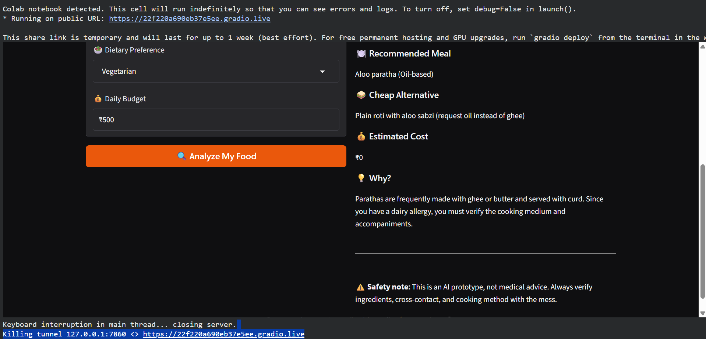

# 🍛 Khana Kya Hai?

### Ranchi Hostel Mess & Allergy Planner

> A small AI-powered tool built for hostel students who want to quickly understand what they can eat from the mess menu based on their dietary restrictions.

## 🤔 Why I Built This

Hostel mess menus are usually simple, but they can become confusing when someone has a food allergy, intolerance, or a specific diet.

A friend may look at a menu and ask:

**"Aaj mess mein kya kha sakta hoon?"**

I built **Khana Kya Hai?** around that simple hostel problem: helping a friend quickly understand what they may be able to eat when allergies or dietary restrictions are involved.

The idea is to take the day's hostel mess menu, a user's allergy or intolerance, dietary preference, and budget, and turn that information into a more useful meal recommendation.

## ✨ What It Does

- Takes the hostel mess menu as input
- Accepts allergies and food intolerances
- Considers dietary preference
- Accepts a daily food budget as additional context
- Uses Google's Gemma open-weight model to analyze the menu
- Separates foods into **avoid**, **verify**, and **suitable-looking** options
- Suggests a simple low-cost alternative when needed
- Includes a safety reminder to verify ingredients with the mess

## 🧠 How It Works

```text
User
  |
  v
Mess Menu + Allergy + Diet + Budget
  |
  v
Google Gemma
  |
  v
Meal Analysis
  |
  v
Safety / Allergy Check
  |
  v
Final Recommendation
```

Gemma is used as the main language-model layer for understanding the menu and generating recommendations.

A separate Python-based checking layer is also used for explicit allergy-related keywords. This means the application does not blindly display the model's output.

The safety layer can move items into a safer category when explicit allergen keywords are detected and can also prevent contradictory recommendations, such as recommending an item that has already been marked for avoidance.

## 🛠️ Tech Stack

- Python
- Google Gemma
- Google AI Studio
- Gradio
- Google Colab

## 🖥️ Demo

The prototype runs from Google Colab and launches a Gradio web interface.

### Example Input

```text
Today's Mess Menu:
Aloo Paratha, Paneer Butter Masala, Rice, Dal, Kheer

Allergy:
Milk / Dairy

Diet:
Vegetarian

Budget:
₹100
```

### Example Output

The application can identify items that may need to be avoided or verified and provide a practical alternative.

```text
Avoid:
- Paneer Butter Masala
- Kheer

Verify:
- Aloo Paratha
- Dal

Suitable-looking:
- Rice

Recommended Meal:
- Rice
```

> ⚠️ The application is an AI prototype and is not medical advice. Ingredients, cooking methods, and cross-contact should always be verified with the hostel mess or food provider.

### Screenshots

#### Home Interface


#### Dairy Allergy Test



## 🔐 API Key Setup

The API key is **not stored in this repository**.

For the Colab version, the API key is stored securely using **Google Colab Secrets**.

Create a secret named:

```text
GEMMA_API_KEY
```

Then enable **Notebook access** for the secret.

## ▶️ How to Run

### 1. Open the notebook

Open:

```text
khana_kya_hai.ipynb
```

in Google Colab.

### 2. Add the API key

In Colab:

```text
Secrets → Add new secret
```

Use:

```text
GEMMA_API_KEY
```

Make sure **Notebook access** is enabled.

### 3. Run the notebook

Run the cells in order.

The notebook launches a Gradio interface where you can enter:

- Mess menu
- Allergies / intolerances
- Dietary preference
- Daily food budget

Then click:

```text
Analyze My Food
```

## 🧪 Testing

The prototype was tested using hostel-style menu examples involving:

- Dairy restrictions
- Peanut restrictions
- Vegetarian meals
- Cooking-method uncertainty
- Budget-based alternatives
- Contradictory recommendation prevention

The goal of these tests is to make the output useful while clearly separating uncertain cases that should be verified.

## 🌱 Why Open-Source AI?

The project uses **Google's Gemma, an open-weight model**, as its AI layer because the challenge focuses on building with open AI and explaining why open innovation matters.

For this project, Gemma is used to interpret the natural-language context of a hostel menu and turn it into a personalized recommendation.

The project also keeps explicit keyword-based safety checks outside the model so that the application has a deterministic layer in addition to generative AI.

This combination was useful for a small real-world problem because the language model handles flexible menu reasoning while the Python layer provides predictable checks for known allergy-related terms.

## 🏆 Hacktoberfest 2026

This project was built for the **Hacktoberfest Weekend Challenge: Build for a Friend**.

### Submission Category

**Best Use of Gemma**

The project uses Google's Gemma as its core AI model and demonstrates how an open-weight model can be used in a practical hostel-food planning application.

## ⚠️ Safety Note

This project is a prototype for educational and hackathon purposes.

It must **not** be treated as a medical or allergy-diagnosis system.

Food ingredients and preparation methods can vary between messes. Users should always verify ingredients, cooking medium, and possible cross-contact with the food provider.

The application uses cautious language such as **avoid**, **verify**, and **suitable-looking** rather than claiming medical certainty.

## 🚀 Future Improvements

- Better ingredient and allergen detection
- Hostel-specific menu history
- More accurate price estimation
- Weekly meal planning
- Local/offline model support
- Personalized food preferences
- Better handling of regional Indian dishes
- More detailed cross-contact detection

## 📄 License

MIT License
